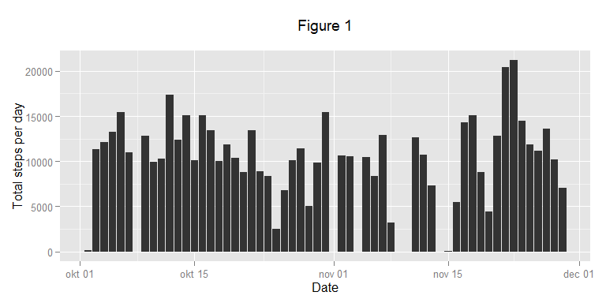
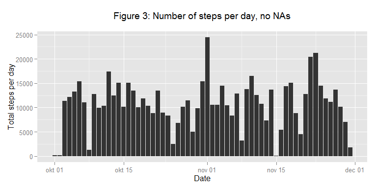
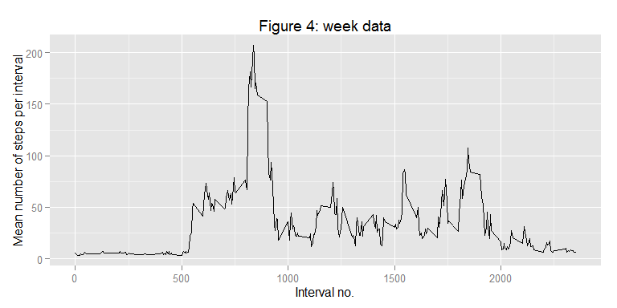
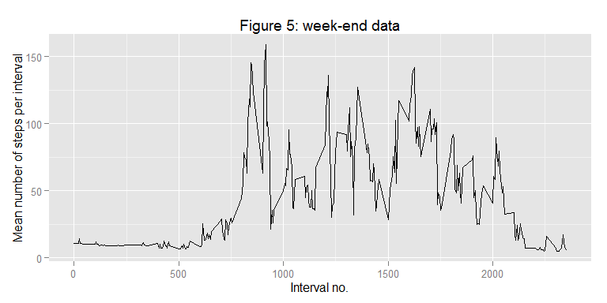

Make knitr copy the figures into a folder named likewise.

```{r}
knitr::opts_chunk$set(tidy=FALSE, fig.path='figures/')
```

##Loading and preprocessing the data and making sure the dates are in class 'Date', not in class 'Factor'.

```{r}
activity <- read.csv("data/activity.csv",header=T, sep=",", quote="\"",stringsAsFactors = FALSE)
activity$date <- as.Date(activity$date)
```


##What is mean total number of steps taken per day?

```{r echo=TRUE}
#summing up the steps per day using aggregate
perday <- aggregate(formula = steps~date, data=activity, FUN=sum, na.action=na.omit)

#calculating mean and median
mean_perday <- mean(perday$steps)
median_perday <- median(perday$steps)

print(mean_perday)
print(median_perday)
```

This R code needs the 'ggplot2' package to be installed on your device.
```{r, steps_perday, fig.width=8, fig.height=4}
require(ggplot2)

#plotting a histogram in ggplot
histogram <-  qplot(perday$date, perday$steps, stat='summary', fun.y=sum, geom='histogram') + 
  labs(title='Figure 1\n',
       y='Total steps per day', x='Date')

plot(histogram)

```


##What is the average daily activity pattern?

```{r}
perinterval <- aggregate(formula = steps~interval, data=activity, FUN=mean, na.action=na.omit)
```


```{r, steps_perinterval, fig.width=8, fig.height=4}
plot2 <- qplot(perinterval$interval, perinterval$steps,geom='line') + 
labs(title="Figure 2", x="Interval no.", y="Mean number of steps per interval")
plot(plot2)

```


##Which 5-minute interval contains the maximum number of steps?
To find this one we just ask R for the row in 'perinterval' where the steps value is largest using function which.
```{r}
perinterval[which(perinterval$steps==max(perinterval$steps)),]
```

##NA-values
1. The amount of missing values
```{r}
#dimensions of 'activity' with only the incomplete cases (NA's). Take the length by adding [1] of the dim() vector c(#rows, #columns=3).
missingvalues <- dim(activity[!complete.cases(activity),])[1]
#missingsteps <- dim(activity[is.na(activity$steps),])[1] #gives the same answer
print(missingvalues)
```

2-3. Filling in the missing values

If a step has a missing value NA, replace that missing value with the average for that step (across multiple days).
```{r}
#head(activity)

miss <- activity[!complete.cases(activity),] #extract the NA rows, keep the rownames (the row numbers they have in 'activity')
head(miss)

fill_miss<-merge(miss,perinterval,by="interval") #use merge (just like index/matching in excel) to go grab an interval's average steps from  'perinterval'.
head(fill_miss) #we now have steps.x and steps.y

activity2<-activity #new data frame
activity2[rownames(miss),1] <- fill_miss$steps.y #miss still knows what row numbers the NA values were at! take activity2 at those rownames, and fill in the 'NA' steps as the 'fill_miss$steps.y'

head(activity2)
```

4. New mean, median, and histogram
```{r}
#summing up the steps per day using aggregate
perday2 <- aggregate(formula = steps~date, data=activity2, FUN=sum, na.action=na.omit)

#calculating mean and median
mean_perday2 <- mean(perday$steps)
median_perday2 <- median(perday$steps)
print(mean_perday2)
print(median_perday2)

```
Now we see the median and mean per day don't change. 
```{r, plot_steps, fig.width=8, fig.height=4}
require(ggplot2)

#plotting a histogram in ggplot
histogram2 <-  qplot(x=date, y=steps, data=perday2, stat='summary', fun.y=sum, geom='histogram') + 
  labs(title='Figure 3: Number of steps per day, no NAs\n',
       y='Total steps per day', x='Date')

plot(histogram2)

```


##Differences in week and week-end days.

```{r}
#Setting the Date format into activity2 as well. It appears to have been lost somewhere along the line.
activity2$date <- as.Date(activity2$date)
activity2$day <- as.integer(format(activity2$date,format = '%u')) %in% c(1:5)
```

```{r, steps_perweekpart, fig.width=8, fig.height=4}

activity2$week <- factor(ifelse(format(activity2$date,format = '%u') %in% c(1:5),'week','week-end'))

weekperinterval <- aggregate(formula = steps~interval, data=activity2[activity2$week=="week",], FUN=mean, na.action=na.omit)

plot3 <- qplot(weekperinterval$interval, weekperinterval$steps,geom='line') + 
labs(title="Figure 4: week data", x="Interval no.", y="Mean number of steps per interval")
```

```{r, steps_perweekendpart, fig.width=8, fig.height=4}
weekendperinterval <- aggregate(formula = steps~interval, data=activity2[activity2$week=="week-end",], FUN=mean, na.action=na.omit)

plot4 <- qplot(weekendperinterval$interval, weekendperinterval$steps,geom='line') + 
labs(title="Figure 5: week-end data", x="Interval no.", y="Mean number of steps per interval")
```

```{r}
library("gridExtra")
grid.arrange(plot3,plot4,nrow=2)
```


Here we can see week-ends seem to bring along more variety and a later start of the day, as can be expected with a standard life-style of studying/working in the week and leisure activities in the week-end.

##Results
The activity data was analyzed per day and per interval. Missing values were filled into 'activity2' by the mean step values of their intervals and the analysis was repeated.
